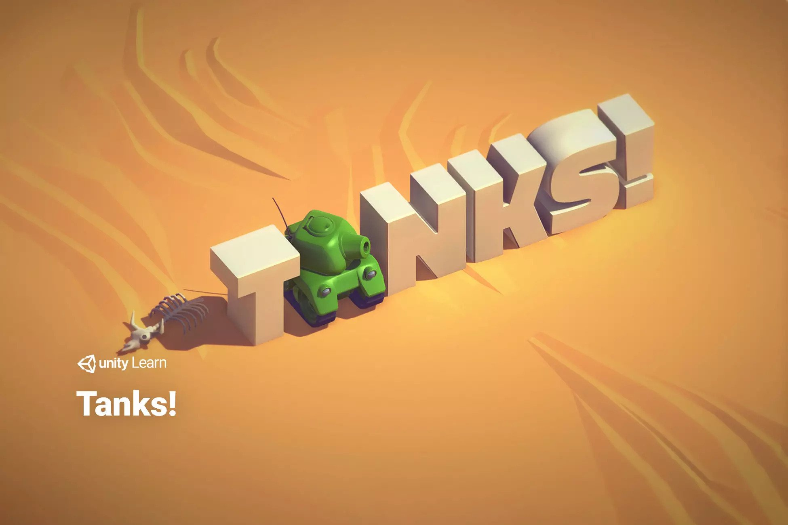
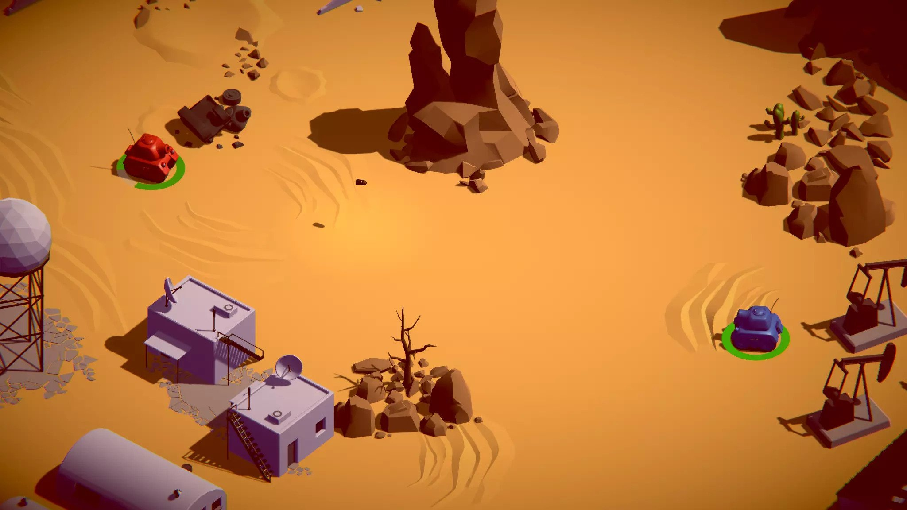
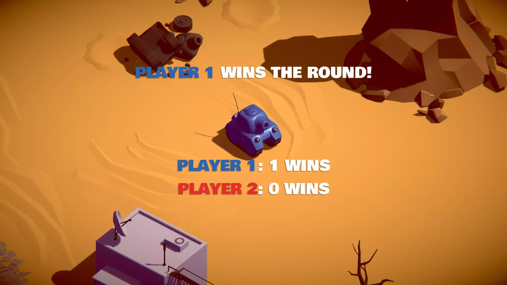

# Tanks Game (Hax0r'd for custom audio)

07062026 - modded build to allow users to swap in assets without rebuilding

READ ME:

This game is a demo to allow students to update the audio files stored on your <build-location>/_AUDIO_ directory into a Unity build without recompiling/coding. 

For example, if your build is located in a folder called "Tankz" on your Windows Desktop, then in that file, there should be a directory called "_AUDIO_". You can update or swap your own audio files into that directory with the names listed below and they will be audible in the game.

This game will load any audio files in the _AUDIO_ directory into the game at launch, using their filenames to correctly assign them to individual game elements. 

To swap in your own files, when the game isn't running, use the following file names:

	background.wav		Background looping music/atmosphere
	tank_shotCharging.wav	Single sound that plays while fire-button (SPACE or Enter) is held
	tank_shotFiring.wav	Single sound that plays while fire-button (SPACE or Enter) is released
	tank_engineIdle.wav	Looping sound that plays for each tank when not moving
	tank_engineDriving.wav	Looping sound that plays for each tank when moving
	shell_explosion.wav	Single sound that plays when shell projectile explodes

	NOTE: if your filenames are not *EXACTLY* as listed below, this will not work.

DEVELOPMENT:

In the root Hierarchy for the Unity project, dynamic file overwriting is done using the "AudioManager" gameObject, with attached scripts found in the Assets/ExternalAudio folder. Scripts found there are currently attached to:

	Assets/Prefabs/Tank
	Assets/Prefabs/Shell
	Assets/Prefabs/ShellExplosion
	
	To Do: Assets/Prefabs/TankExplosion

Additionally, to test without building the app, a copy of the audio files (with above-listed filenames) can be found in the root "Assets/" directory. These are not used during runtime. To verify that these were not being used, an underscore "_" was appended to each file in "Assets" (rename without the "_" to test in editor).

CUE LOG FOR DOWNLOADED AUDIO:

	Anime-style battle music:

   		https://freesound.org/people/Sirkoto51/sounds/414214/
		414214__sirkoto51__anime-fight-music-loop-1.wav
		background_anime.wav

	Horror/Ambient background loop:

		https://freesound.org/people/ClementPanchout/sounds/573379/
		573379__clementpanchout__horror-ambient-soundscape-loop.wav
		background_horror.wav

	8-bit Game loop:

   		https://freesound.org/people/Mrthenoronha/sounds/515615/
		515615__mrthenoronha__8-bit-game-theme.wav
		background_8bit.wav
  
----------------------------------------------------------------------------------------

ORIGINAL README:

3D Tanks Game is a 2 player shooter game using one keyboard that uses simple game mechanics, integrating world and screen space UI, as well as game architecture and audio mixing...

It was implemented following [Tanks Tutorial](https://learn.unity.com/project/tanks-tutorial) on Unity Learn Platform, it was originally recorded at Unite Boston 2015.

## Images 

 
  
 
  
 
  

## Links

- [Tanks Tutorial](https://learn.unity.com/project/tanks-tutorial), contains video tutorial, instructions, snippet codes.. (The best place to start).
- [Tanks Assets](https://assetstore.unity.com/packages/essentials/tutorial-projects/tanks-tutorial-46209).
- [Tanks Tutorial Slides](https://connect-prd-cdn.unity.com/20190226/8099b21d-6563-424c-9e01-958fe16bdbf7_TanksTutorialSlideDeck_v1.pdf).
